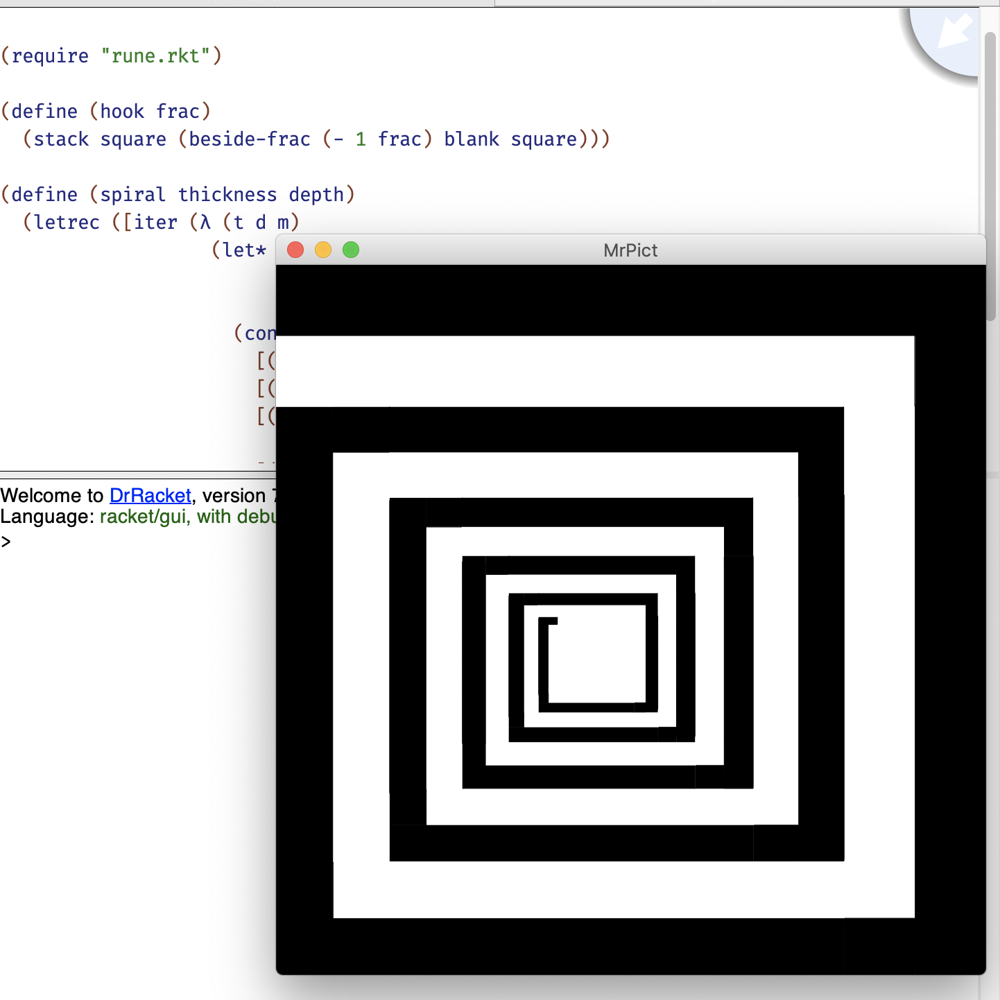

# RUNE-Racket

A Racket port for RUNE library used in CS1101S of National University of Singapore.




All function names remain unchanged as [](https://sicp.comp.nus.edu.sg/source/RUNES/index.html)
('_' is replaced by lisp-style '-'). Due to the color of a picture cannot be changed after the
picture has been generated in Racket, ```anaglyph```, ```overlay``` and ```overlay_frac``` are not
implemented.

A function ```above``` is implemented to overlay two runes without spacing height. This can partly
substitute function ```overlay``` and ```overlay_frac```.

```heart``` and ```ribbon``` adopt different method from what original RUNE library uses, which
makes them look slightly different from original ones.
